# 商城系统网站

### 完整项目获取

通过网盘分享的文件：前后端分离电商系统

链接: https://pan.baidu.com/s/1vppvtFd_xa-LVeWQyhF7lQ?pwd=5pmw 提取码: 5pmw --来自百度网盘超级会员v3的分享

通过网盘分享的文件：工具包

链接: https://pan.baidu.com/s/1YmdoJvkjoUjA75wvHLDZ6A?pwd=xm96 提取码: xm96
--来自百度网盘超级会员v3的分享

需要远程项目部署或项目修改和毕业设计也可联系（添加申请时请备注好来意）

通过网盘分享的文件：远程调试部署联系方式

链接: https://pan.baidu.com/s/1W0dDcoZmayG0c7USJDYBYg?pwd=nqd7 提取码: nqd7
--来自百度网盘超级会员v3的分享

### 项目合集(项目不断更新中)
链接: https://pan.baidu.com/s/1nY-zhvAK0CXYcn3g7LzQnQ?pwd=id3c 提取码: id3c
--来自百度网盘超级会员v3的分享

#### 这些项目一起发你了 可以分享给你需要的同学 调试可找我 也接二次修改和项目定制、毕业设计等

## 接毕业设计和论文

微信联系方式：xzxj0206  QQ：3808981644   (支持修改、 部署调试、 支持代做毕设)

接网站建设、小程序、H5、APP、各种系统等，单片机、嵌入式也可以做

选题+开题报告+任务书+程序定制+安装调试+论文+答辩ppt  都可以做

## 一、介绍

基于SpringBoot+Vue的前后端分离商城系统网站

后台： SpringBoot + Mybatis-plus + Mybatis + Hutool工具包 + lombok插件

前台：Vue + Vue Router + ELementUI + Axios

功能：首页推荐、轮播图管理、商品、订单、购物车、商品评论、商品评论点赞、商品收藏、商品点赞、订单支付、公告。

角色：管理员、用户

## 二、系统运行界面

### 1、后端运行界面

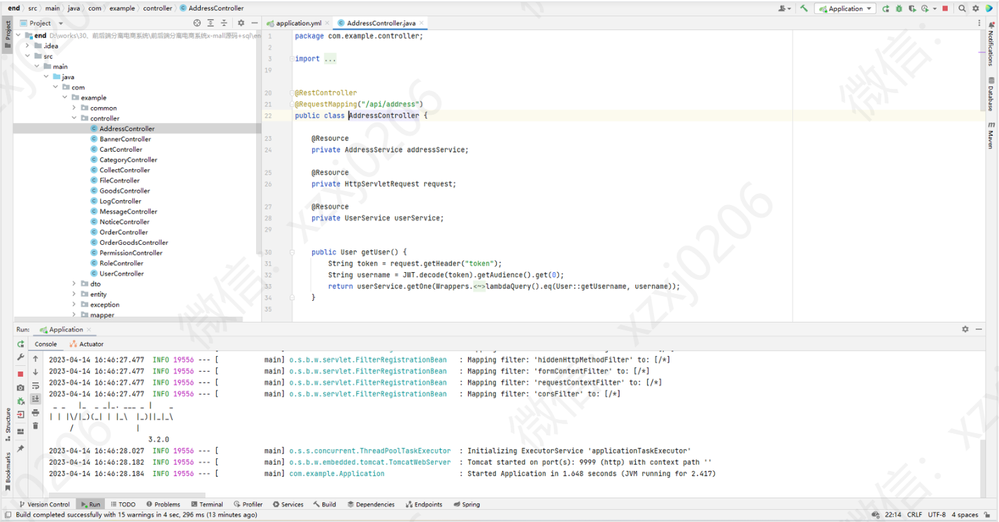

### 2、前端运行界面

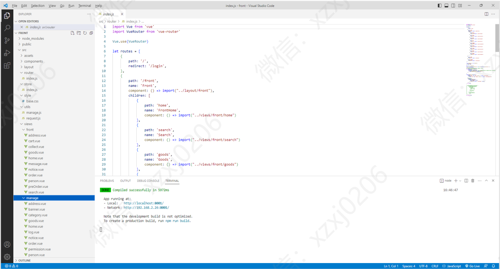

## 三、系统部分功能界面截图

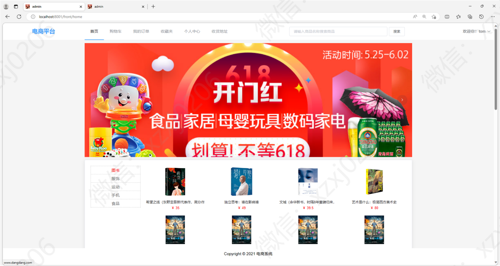

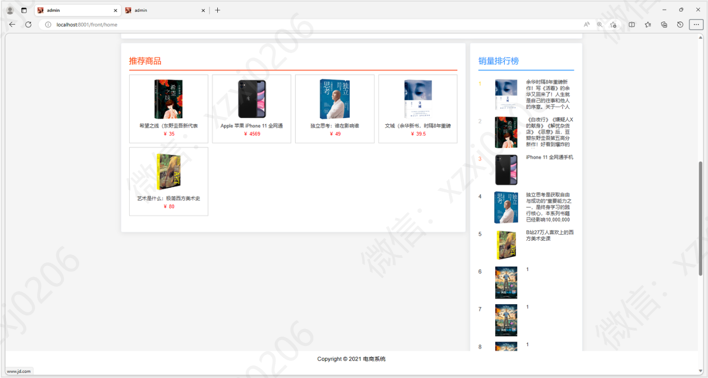

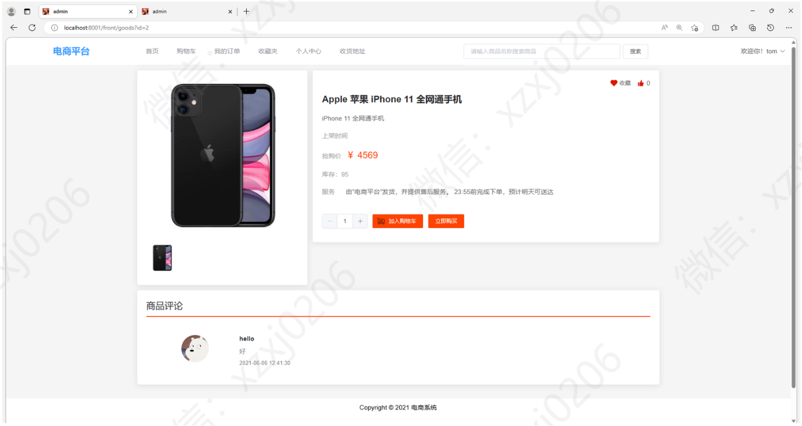

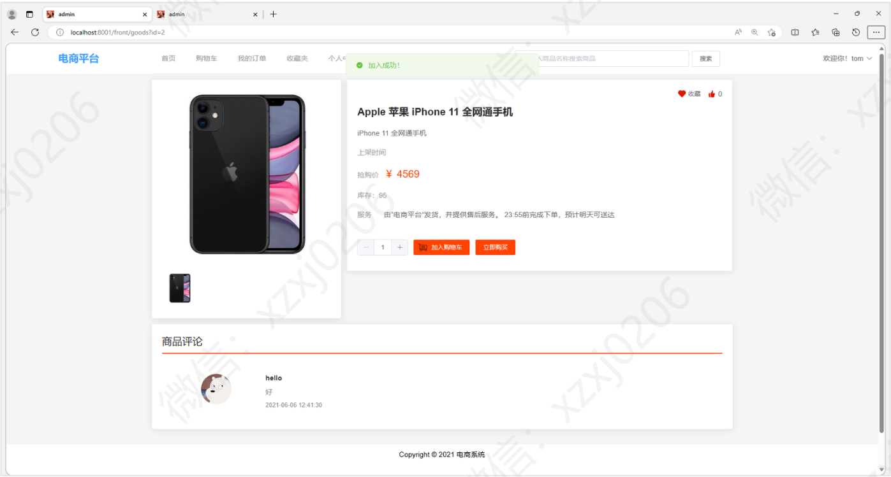

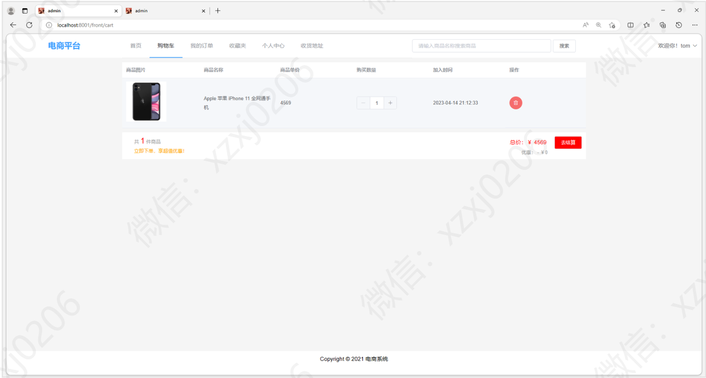

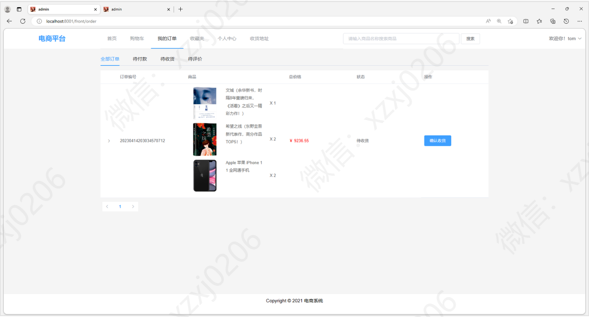

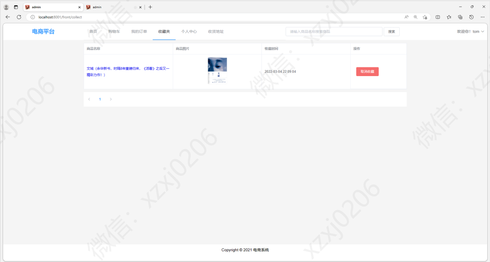

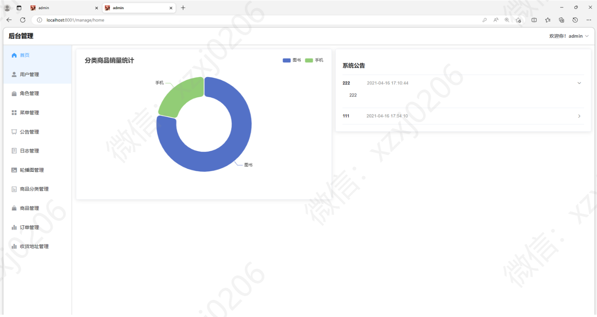

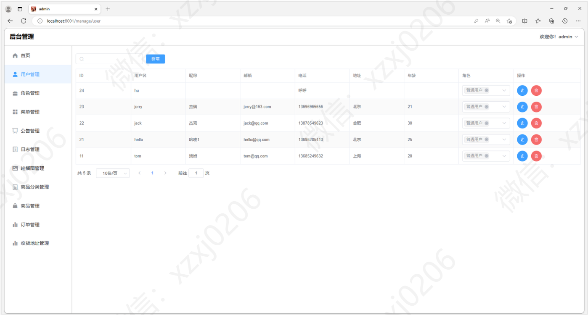

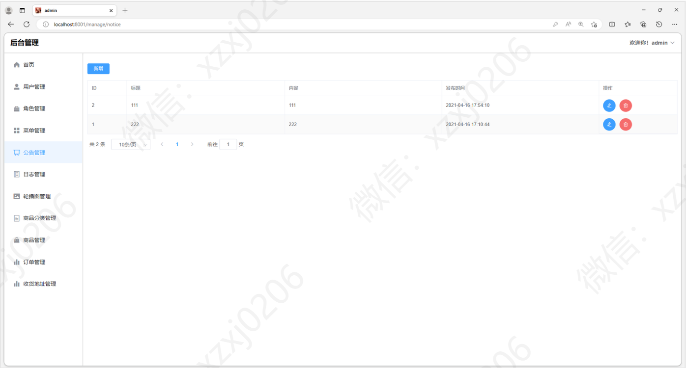

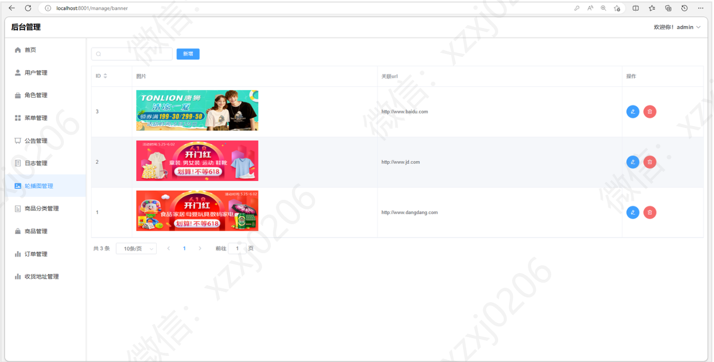

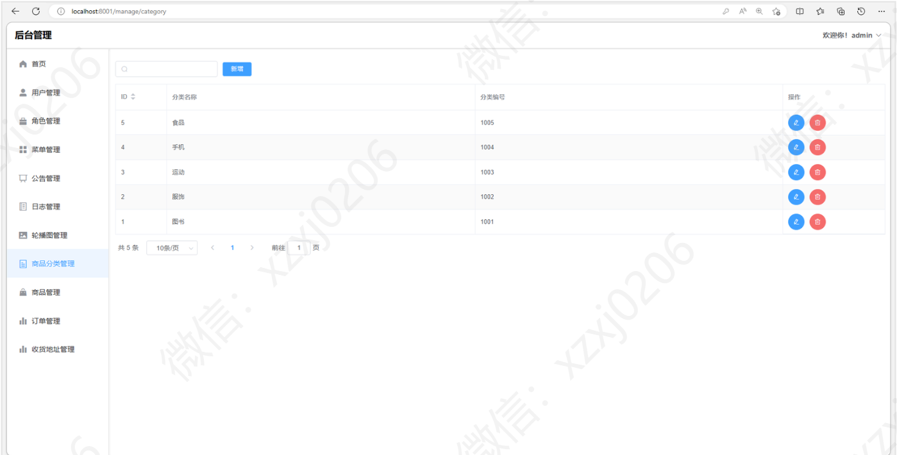

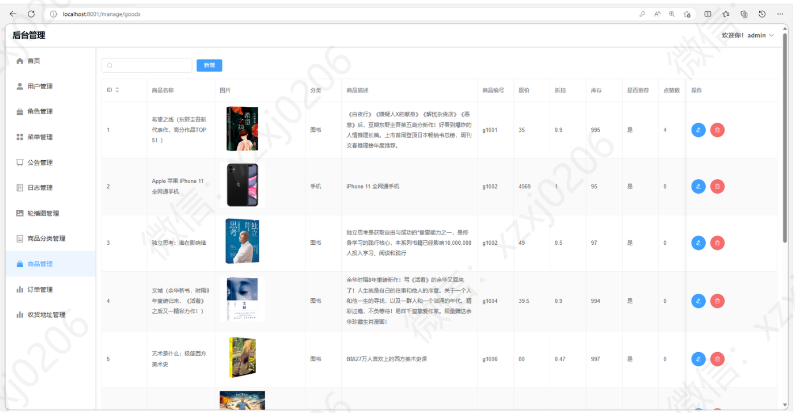

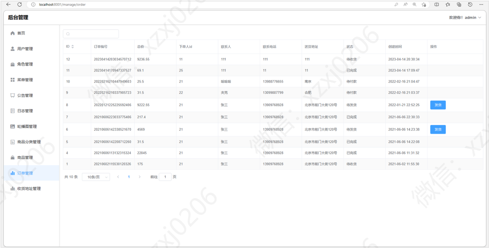

