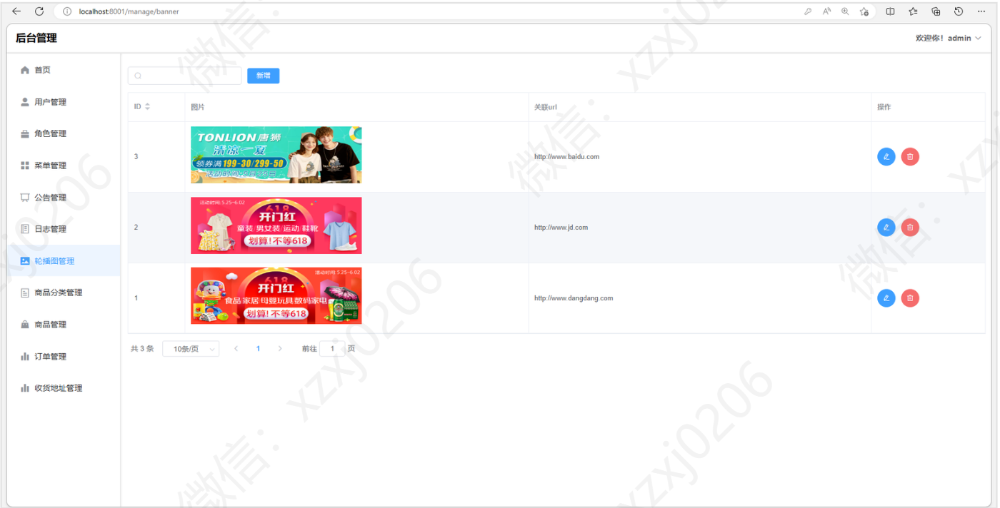
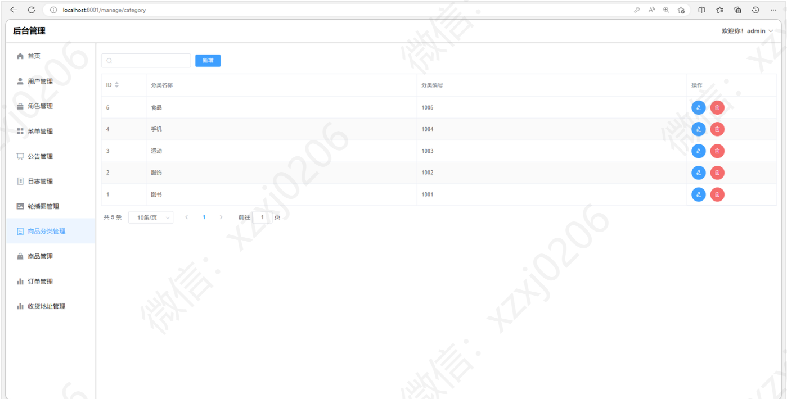

# 商城系统网站

### 有问题，或者需要协助调试运行项目的, 可以添加 QQ：2529519551 ，或者wx ：xzxj0206

## 一、介绍

基于SpringBoot+Vue的前后端分离商城系统网站

后台： SpringBoot + Mybatis-plus + Mybatis + Hutool工具包 + lombok插件

前台：Vue + Vue Router + ELementUI + Axios

功能：首页推荐、轮播图管理、商品、订单、购物车、商品评论、商品评论点赞、商品收藏、商品点赞、订单支付、公告。

角色：管理员、用户

## 二、系统运行界面

### 1、后端运行界面

### 2、前端运行界面

## 三、系统部分功能界面截图

